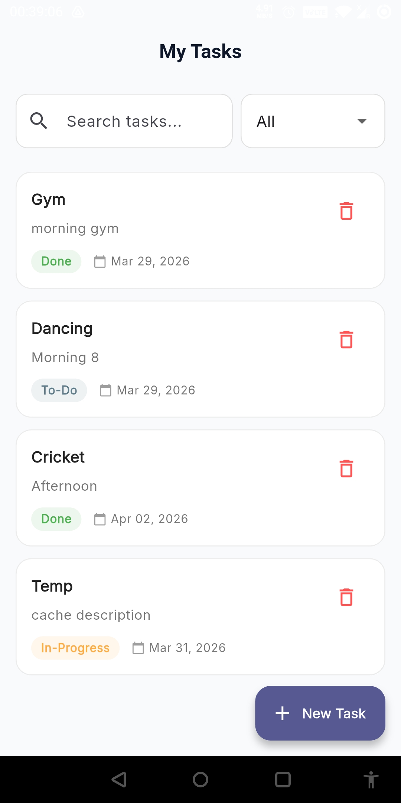
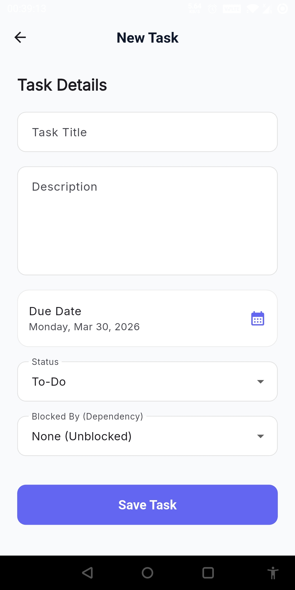

# Task Management Application (Flutter + FastAPI)

This is a full-stack Task Management application strictly developed using modern practices. 
The frontend is built inside `frontend` using **Flutter** and **flutter_bloc** state management. 
The backend is placed in `backend` providing a lightning-fast REST API through **FastAPI** connected to a local **SQLite** database.

App video demo: [click here to watch app demo](https://drive.google.com/file/d/1CO9yeqfbe9QHM6iHBF8D9h4rTdiC3RoA/view)

Apk file: [click here to download](https://drive.google.com/drive/folders/1Q1hEGRPI2jZ-nBY9c6M72UF01ylYY4tL)

## 🛠️ Step 1. Clone & Setup Repository

```bash
# Clone the repository
git clone https://github.com/imrosun/task-manager-flutter-fastapi.git
cd task-management-flodo-flutter
```

## 🔌 Step 2. Start the FastAPI Backend

We will run the backend on your computer and open it across your internal Wi-Fi network.

1. Open your terminal natively to the `backend` folder:
```bash
cd backend
```
2. Initialize and activate Python Virtual Environment (Highly Recommended):
**(Windows)**
```cmd
python -m venv venv
venv\Scripts\activate
```
**(Mac/Linux)**
```bash
python3 -m venv venv
source venv/bin/activate
```
3. Install the dependencies:
```cmd
pip install -r requirements.txt
```
4. Find out your computer's local Wi-Fi IP address so your phone can reach it.
**(Windows)**
```cmd
ipconfig
```
*(Look for your Wi-Fi interface and locate the `IPv4 Address`. For example: `192.168.1.5`)*

5. Run the server using `uvicorn`, explicitly bounding it to `0.0.0.0` to permit external smartphone connections instead of just `localhost`:
```cmd
uvicorn main:app --host 0.0.0.0 --port 8000 --reload
```

## 📱 Step 3. Connect & Run the Flutter Frontend

1. Open a new terminal instance and navigate natively to the `frontend` folder:
```bash
cd frontend
```
2. Download packages/dependencies:
```cmd
flutter pub get
```
3. Open the `.env` configuration file located at `frontend/.env`. Update `API_BASE_URL` by replacing it exactly with your computer's `ipconfig` output from earlier:
> Example `frontend/.env`:
> ```env
> API_BASE_URL=http://191.161.1.5:8000
> ```

4. Run the application onto your attached debug device or simulator:
```cmd
flutter run
```

## Screenshot
<p>
    
    
</p>

---

## 🌟 Application Features Checklist
- [x] CRUD Operations explicitly hooked through Bloc
- [x] 2-Second Simulated Submission Handlers (Protected against Double-clicks)
- [x] "Dependent Task" State Lock Architecture
- [x] Background Memory Saving System (SharedPreferences Drafts)
- [x] Debounced 300ms Dynamic Regex Highlights Search
